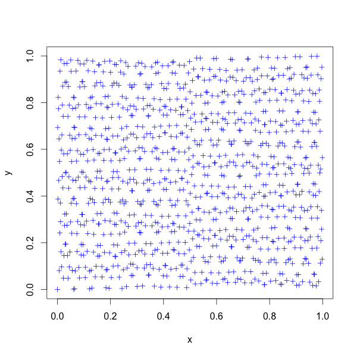
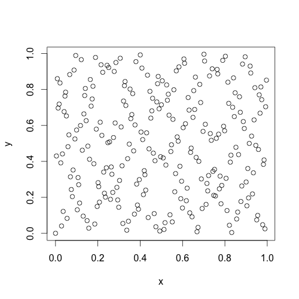

# polylatbuilder

_A code for constructing rank-1 polynomial lattice rules_

#### Introduction 
This project is part of my 4-months research internship at DIRO's optimization and simulation laboratory, conducted under the supervision of Pierre L'Ecuyer and cosupervised by David Munger. 

Like lattice rules, polynomial lattice rules are among the [quasi-Monte Carlo methods](https://en.wikipedia.org/wiki/Quasi-Monte_Carlo_method), which are used as an alternative to Monte Carlo methods to integrate multidimensional functions. 
The goal of this project is to consctrut polynomial lattice rules, in C++, in order to be integrated in [Lattice Builder software](https://github.com/umontreal-simul/latbuilder). 

#### Dependency 

[NTL](http://www.shoup.net/ntl/) Number Theory Library. 

#### Compilation 

      g++ -g -O2 -I$path/to/NTL/include main.cpp tools.cpp -o main.exe -L$path/to/NTL/lib -lntl -lgmp -lm

#### Execution 
Once you the compilation done, you can run the code by executing 
      ./main.exe

It will ask you for parameters : 

      Enter the precision : 
      30
      Enter the power m (such as the number of points is 2^m):
      10
      Enter the dimension :
      5
      Enter the iteration :
      10
      Enter the search type : 
      (CBC for component by component search, Korobov for Korobov PLR, Random for random search)
      Korobov
      Do you want to output points ? (y/n)
      n

Then it will output the modular polynomial and the component of the generating polynomial vector, for example in the precedent case, we will have : 

      Polynomial P is [1 0 0 1 0 0 0 0 0 0 1]
      Generating vector z in 5 dimensions :
            Poly[0] = [1]
            Poly[1] = [0 0 0 1 0 1 1]
            Poly[2] = [1 0 1 1 0 1 1]
            Poly[3] = [1 0 1 0 0 1 0 1 1]
            Poly[4] = [0 0 1 1 1 1 1]

#### Plot 

If you choose to output the points, you will have s lines, each one with 2^m value with precision w. Then you can use them for multidimensional integration or plot them in a 2-by-2 dimensions using 
* [Matplotlib](http://matplotlib.org/) for matlab users 
* [gnuplot](http://www.gnuplot.info/) for C++ users
* [Rstudio](https://www.rstudio.com/) for R users 

We can obtain such lattices : 

2^10 = 1024 points

2^8  =  256 points

